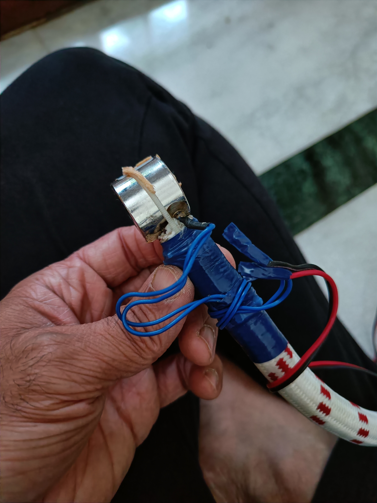
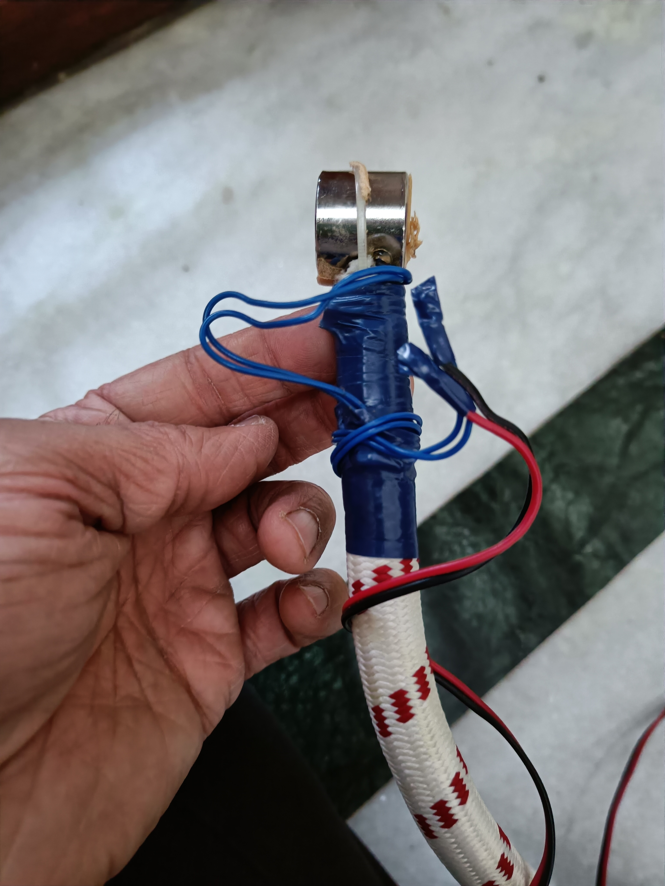
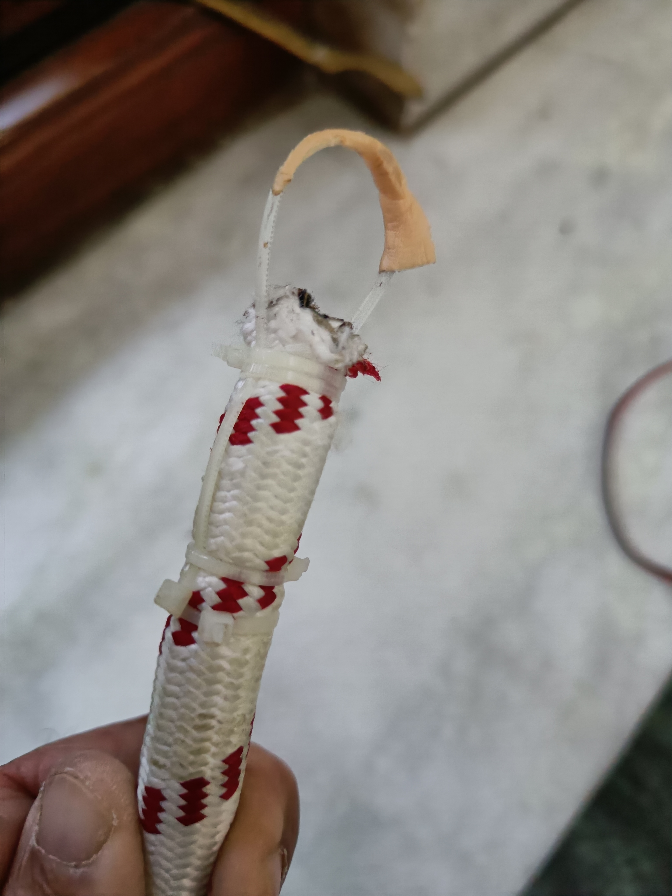
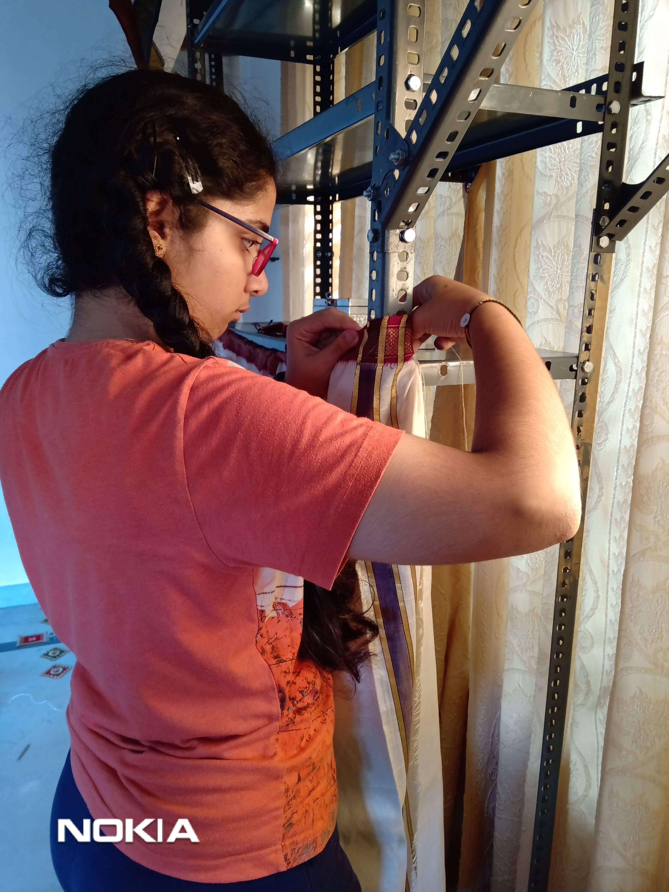
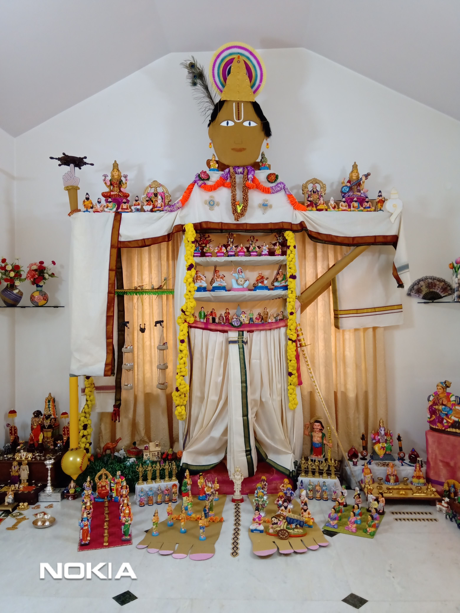

# Tech Dasara

Every year we celebrate dasara festival in a unique way by adding our own technological elements. Here is one of our experiments.

I have designed and assembled the handcuffs, which endured many falls. See the video above :)

A few years back, we had done the vishwaroopa darshana of Lord Krishna. I have contributed by designing and stitching the dhoti.

